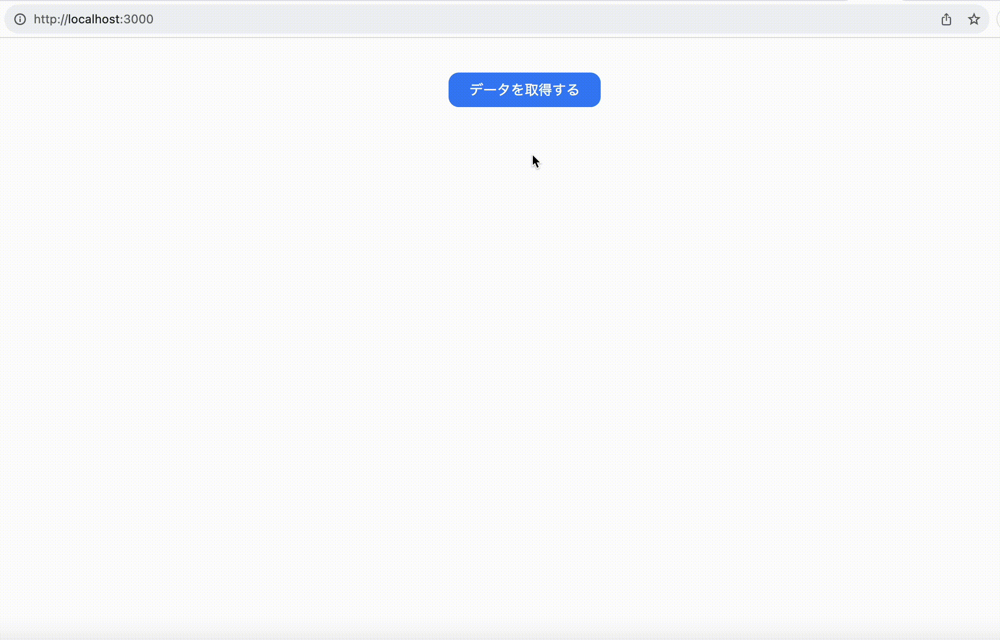

# Next 13 + Suspense + Recoilでデータ取得を実装する例

Next 13のクライアントコンポーネントでSuspenseを仕様する例を掲載しています。

## 実装経緯
現在作っているアプリで下記仕様を満たすような挙動が必要だったため、サンプルとして作ってみました。

## 仕様
1. 「データを取得する」ボタンを押すとデータ取得処理が開始されます。
2. データ取得処理は意図的に2秒程度かかるようにしてあります。
3. データ取得処理中はローディングのアニメーションとテキストを表示します。(ここでSuspenseが使えます。)
4. データ取得終了後、Recoilにデータを格納し、他のページのリンクを表示します。
5. リンクをクリックし、ページに移動すると取得したデータを閲覧できます!!

## 使用技術
- Next.js (App Router, TypeScript)
- Suspense
- Recoil
- SWR
- TailwindCSS
- jsonplaceholder

## 参考
- (公式doc) Loading UI and Streaming (https://nextjs.org/docs/app/building-your-application/routing/loading-ui-and-streaming)
- (Udemy) 今後のフロントエンド開発で必須知識となるReact v18の機能を丁寧に理解する (https://www.udemy.com/course/react_v18/)
- (Zenn) Next.js 13 の React Server Components(RSC) とデータフェッチ (https://zenn.dev/tfutada/articles/36ad71ab598019)
